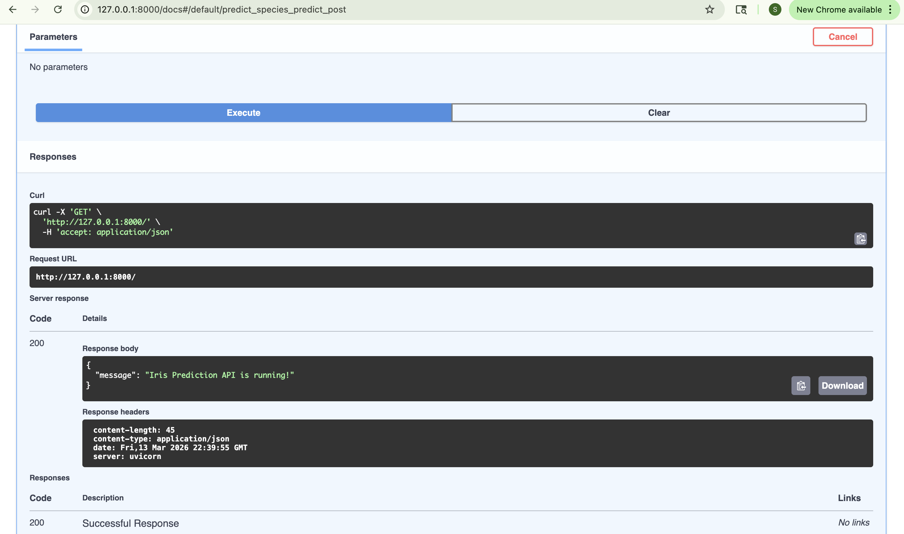
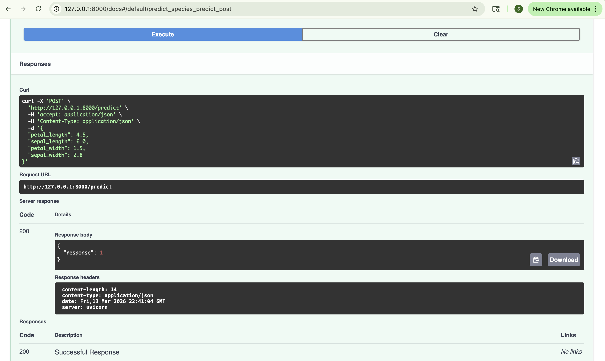

# 🌸 FastAPI Iris Prediction API

> **Lab Assignment 4** — Exposing ML Models as APIs using FastAPI and Uvicorn  
> **Modification:** Upgraded from `DecisionTreeClassifier` to `RandomForestClassifier`

---

## 📌 Overview

This Lab demonstrates how to train a Machine Learning model and serve it as a REST API using **FastAPI** and **Uvicorn**. The API accepts Iris flower measurements and returns the predicted species.

In real-world ML engineering, models need to be accessible to other apps, websites, and services. This lab teaches exactly that — wrapping a trained model in a web API so anyone can call it.

---

## 🛠️ Tech Stack

| Tool | Purpose |
|------|---------|
| **FastAPI** | Python web framework to build the API |
| **Uvicorn** | ASGI web server to run the FastAPI app |
| **Scikit-learn** | ML library to train the model |
| **Pydantic** | Data validation for API inputs/outputs |
| **Pickle** | Save and load the trained model |

---

## ✅ Modification from Original Lab

| | Original Lab | This Submission ✅ |
|---|---|---|
| Model | `DecisionTreeClassifier` | `RandomForestClassifier` |
| How it works | 1 tree makes the decision | 100 trees vote, majority wins |
| Accuracy | Lower | Higher |
| Overfitting | Prone to it | Much more resistant |
| Real-world use | Rarely used alone | Industry standard |

### Why RandomForest?
- A single Decision Tree can easily overfit to training data
- RandomForest builds **100 decision trees** and combines their results
- This makes predictions far more **accurate and reliable**
- `n_estimators=100` → 100 trees vote on every prediction
- `random_state=42` → results are reproducible every run

---

## 🗂️ Project Structure

```
fastapi_lab1/
├── model/
│   └── iris_model.pkl        ← saved trained model (auto-generated)
├── src/
│   ├── __init__.py           ← marks src as a Python package
│   ├── data.py               ← defines input/output data shapes
│   ├── train.py              ← trains and saves the ML model ⭐ modified
│   ├── predict.py            ← loads model and runs predictions
│   └── main.py               ← FastAPI app with all endpoints
├── fastapi_lab1_env/         ← virtual environment (not pushed to git)
├── requirements.txt          ← all required packages
└── README.md
```

---

## ⚙️ Setup Instructions

### 1. Clone the Repository
```bash
git clone https://github.com/patnamsanjana15/fastapi_lab1.git
cd fastapi_lab1
```

### 2. Create and Activate Virtual Environment
```bash
# Create virtual environment
python3 -m venv fastapi_lab1_env

# Activate (Mac/Linux)
source fastapi_lab1_env/bin/activate

# Activate (Windows)
fastapi_lab1_env\Scripts\activate
```

### 3. Install Required Packages
```bash
pip install -r requirements.txt
```

### 4. Train the Model
```bash
cd src
python3 train.py
```
Expected output:
```
✅ RandomForest model trained and saved successfully!
```

### 5. Start the API Server
```bash
uvicorn main:app --reload
```
Expected output:
```
INFO:     Uvicorn running on http://127.0.0.1:8000
INFO:     Application startup complete.
```

---

## 🔗 API Endpoints

### `GET /`
Health check — confirms the API is running.

**Response:**
```json
{
  "message": "Iris Prediction API is running!"
}
```

---

### `POST /predict`
Accepts flower measurements and returns the predicted species.

**Request Body:**
```json
{
  "petal_length": 1.4,
  "sepal_length": 5.1,
  "petal_width": 0.2,
  "sepal_width": 3.5
}
```

**Response:**
```json
{
  "response": 0
}
```

**Species Mapping:**
| Response | Species |
|----------|---------|
| `0` | Iris Setosa 🌸 |
| `1` | Iris Versicolor |
| `2` | Iris Virginica |

---

## 🧪 Testing the API

After starting the server, open your browser and go to:

```
http://127.0.0.1:8000/docs
```

FastAPI automatically generates an **interactive Swagger UI** page where you can test all endpoints without any extra tools.

### How to test:
1. Click **POST /predict**
2. Click **"Try it out"**
3. Enter your flower measurements in the request body
4. Click **Execute**
5. See the predicted species in the response!

---

## 📸 Screenshots

### ✅ Health Check — GET /


The root endpoint confirms the API server is running successfully with a `200 OK` response.

---

### ✅ Prediction Test 1 — Iris Setosa (response: 0)
Input:
```json
{
  "petal_length": 1.4,
  "sepal_length": 5.1,
  "petal_width": 0.2,
  "sepal_width": 3.5
}
```
Result: `{"response": 0}` → **Iris Setosa** 🌸

---

### ✅ Prediction Test 2 — Iris Versicolor (response: 1)


Input:
```json
{
  "petal_length": 4.5,
  "sepal_length": 6.0,
  "petal_width": 1.5,
  "sepal_width": 2.8
}
```
Result: `{"response": 1}` → **Iris Versicolor** ✅

---

## 🔁 How It All Works Together

```
python3 train.py
    → RandomForest trains on 150 Iris samples (100 trees)
    → Saves model as iris_model.pkl

uvicorn main:app --reload
    → API goes live at http://127.0.0.1:8000

User sends flower measurements to POST /predict
    → main.py receives and validates the request
    → Calls predict() in predict.py
    → predict.py loads iris_model.pkl
    → 100 trees vote on the species
    → Returns 0, 1, or 2
    → User gets {"response": 0} = Iris Setosa 🌸
```

---

## 📦 Requirements

```
fastapi[all]
scikit-learn
pydantic
```

---

## 📝 Key Learnings

- How to train and serialize (save) an ML model using `pickle`
- How to build REST API endpoints using **FastAPI decorators** (`@app.get`, `@app.post`)
- How **Pydantic models** automatically validate incoming request data
- How **Uvicorn** serves a FastAPI application as a live web server
- Why **RandomForest** is more reliable than a single Decision Tree
- How to use FastAPI's built-in **Swagger UI** (`/docs`) for interactive testing
